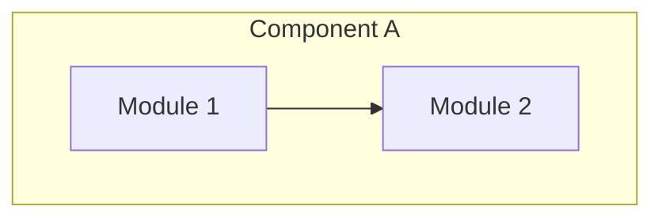

# pr

GitHub PR 생성/업데이트를 자동화하는 Claude Code 스킬.
JIRA 태깅, 커밋 정리, 시각적 diff 다이어그램, 한국어 설명을 포함한다.

## Overview

현재 브랜치의 코드 변경사항을 분석하여 구조화된 PR을 생성하거나 업데이트한다.
실제 코드 diff에 기반한 분석(커밋 메시지가 아님), Mermaid 아키텍처 다이어그램,
인터랙티브 HTML 시각 diff 리뷰를 포함한다.

## Trigger

"create a PR", "open a pull request", "make a PR", "update the PR description", "pr", "PR" 등.
PR 리뷰, 머지, 상태 확인, 닫기에는 트리거하지 않음.

## 워크플로우 (13단계)

### 단계 0: review-claudemd 사전 점검
- `/review-claudemd` 스킬로 CLAUDE.md 파일 분석 및 자동 업데이트

### 단계 1-3: 브랜치 & 베이스 감지
- main/master 브랜치 차단
- 기존 PR의 base 브랜치 확인 또는 parent 브랜치 자동 감지
- main 직접 타겟 금지

### 단계 4-5: 린팅
- `uv run pre-commit run --all-files` (필수)
- 프론트엔드 ESLint `--fix` + manual stage 훅

### 단계 6: 커밋 정리
- Protected 브랜치(`release/*`, `main`, `master`)에서는 스킵
- 백업 태그 생성 → soft reset → `/commit` 스킬로 원자적 재커밋
- `--force-with-lease`로 푸시
- 트리 해시 검증으로 코드 무결성 확인

### 단계 7-8: 분석
- `git log origin/{base}..HEAD`에서 JIRA 태그 추출
- `git diff origin/{base}..HEAD`로 코드 변경 분석
- **목적/의도 기반** 그룹핑 (구현 상세가 아님)

### 단계 9: 시각적 Diff 다이어그램
- `/visual-explainer` 스킬로 인터랙티브 HTML 생성
- GitHub Gist에 업로드 (비공개)
- Mermaid `graph TD/LR` 다이어그램 생성
  - `<br/>`로 줄바꿈 (절대 `\n` 사용 금지)
  - 특수문자가 있는 노드 레이블은 반드시 따옴표

### 단계 10: PR 제목
```
[TAG-1] [TAG-2] 문제 해결 중심 문장
```
- "What code did I change?" ✗
- "What problem does this solve?" ✓

### 단계 11: PR 설명 형식

```markdown
## Visualized Diagram
[Interactive Visual Diff Review (HTML)](GIST_URL)

## Summary
[한국어: PR 목적 요약]

## Key Changes
- [목적 기반 통합 설명]

Related JIRA: [PII-1234](https://deepingsource.atlassian.net/browse/PII-1234)

## Diagram


## Changes by Component
### Component Name
- Technical change 1

## Breaking Changes
None
```

### 단계 12-13: 생성/업데이트 & 할당
- `--body-file` 사용 (인라인 문자열 금지 — backtick 이스케이프 방지)
- `gh pr edit --add-assignee @me`

## 규칙

- "Generated with Claude Code" 또는 Claude attribution 금지
- PR 본문은 `--body-file`로 전달 (Mermaid 코드 펜스 보존)
- `git merge-base` 대신 `origin/{base}..HEAD` 사용
- 모든 내용은 실제 코드 diff 기반

## 의존성

- GitHub CLI (`gh`)
- `/commit`, `/review-claudemd`, `/visual-explainer` 스킬
- `uv`, `pre-commit`
