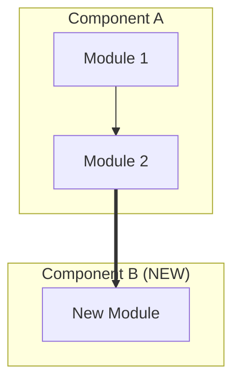

# Git Context

- **Current branch**: !`git branch --show-current`
- **Existing PR**: !`gh pr view --json number,baseRefName,url 2>/dev/null || echo "No PR exists"`
- **Upstream tracking**: !`git rev-parse --abbrev-ref @{upstream} 2>/dev/null || echo "No upstream"`

---

# Create or Update Pull Request

This skill creates a new PR or updates an existing one for the current branch.

**Critical principles:**
- PR content is based on actual code diff analysis, NOT commit messages
- Commits are used ONLY for extracting JIRA tags
- Always use `origin/{base_branch}..HEAD` for commits and diff (NOT `merge-base`)
- NEVER target `main` or `master` as base branch -- stop and warn if no other base branch is found
- **PURPOSE-DRIVEN, not implementation-driven** -- always ask "What problem does this solve?" not "What code did I change?"
  - Bad: 3 separate bullets for "멀티 GPU FPS 모니터링", "3단계 FPS 모니터링", "조건부 모니터링"
  - Good: 1 bullet "단계별 FPS 모니터링 체계 구축" (with optional sub-bullets for details)

## Steps:

0. **Run review-claudemd pre-flight check**
   - Before any PR work, invoke the `/review-claudemd` skill to analyze recent conversations
   - **Automatically draft and apply** all recommended edits to CLAUDE.md files (global and local) -- do NOT stop to ask the user for confirmation
   - After edits are applied, check if any files changed: `git diff --name-only`
   - If files changed, invoke the `/commit` skill to commit the CLAUDE.md updates
   - Then proceed to step 1

1. **Get current branch and check if it's main/master**
   - Exit if on main/master branch

2. **Check if PR already exists and get base branch**
   - Use `gh pr view --json baseRefName,headRefName` to check for existing PR
   - If PR exists, use `baseRefName` as the base branch (this is the authoritative source)
   - Store the base branch for subsequent steps

3. **Find the base branch** (only if no PR exists)
   - Priority order for base branch detection:
     1. Check upstream tracking: `git rev-parse --abbrev-ref @{upstream}` (e.g., `origin/release/3.3`)
        - If upstream is `origin/<current-branch>` (self-tracking), skip this and continue to next priority
     2. Check if branch name contains release version and find matching release branch
     3. **Detect parent branch** (the branch this branch was created from):
        ```bash
        # Find the first commit unique to this branch (vs main)
        FIRST_COMMIT=$(git log origin/main..HEAD --format=%H | tail -1)
        # Get its parent commit
        PARENT_COMMIT=$(git rev-parse ${FIRST_COMMIT}^)
        # Find which remote branch contains that parent commit
        # Exclude HEAD and current branch, pick the most recently committed one
        PARENT_BRANCH=$(git branch -r --contains $PARENT_COMMIT --sort=-committerdate \
          | grep -v HEAD \
          | grep -v "origin/$(git branch --show-current)" \
          | head -1 \
          | sed 's/^[[:space:]]*//' \
          | sed 's|^origin/||')
        ```
        - If a parent branch is found (e.g., `PII-1930`), use it as the base branch
        - This correctly handles feature branches created from other feature branches
     4. If no parent branch is found, **STOP and warn the user** that the base branch could not be determined. Do NOT fall back to `main` or `master` -- PRs must never target main directly.
   - **IMPORTANT**: Do NOT use `git merge-base` for determining which commits belong to this branch
   - The base branch is the branch this PR will merge INTO, not the common ancestor

4. **Run pre-commit checks (MANDATORY — must pass before PR creation)**
   - Run `uv run pre-commit run --all-files` and ensure ALL hooks pass
   - If any hooks auto-fix files, re-stage them with `git add <specific-file>`
   - If ruff check fails, run `uv run ruff check --unsafe-fixes --fix` to auto-fix, then re-run pre-commit
   - If any files were changed, invoke the `/commit` skill to commit the fixes before proceeding
   - **Do NOT proceed to step 5 until pre-commit passes cleanly**

5. **Run frontend lint checks (manual stage)**
   - First, auto-fix all fixable errors by running ESLint with `--fix` in all frontend directories in parallel:
     ```bash
     (cd dashboard-front && npm run lint -- --fix) &
     (cd usertool && npm run lint -- --fix) &
     (cd dashboard-api && npm run lint -- --fix) &
     wait
     ```
   - Then verify by running `uv run pre-commit run --hook-stage manual --all-files`
   - This step is MANDATORY and must not be skipped
   - **If any files were changed by the lint fix** (check with `git diff --name-only`):
     - Invoke the `/commit` skill to commit the lint fixes before proceeding
     - Resume the PR workflow from step 6 after the commit is done

6. **Consolidate commit history**

   **NEVER run commit consolidation on protected branches (`release/*`, `main`, `master`).** These branches have branch protection rules and rewriting history will be rejected. Skip directly to step 6 if the current branch matches any protected pattern.

   **5.1 Count commits on this branch**
   ```bash
   CURRENT_BRANCH=$(git branch --show-current)

   # Skip consolidation entirely on protected branches
   if [[ "$CURRENT_BRANCH" == release/* || "$CURRENT_BRANCH" == "main" || "$CURRENT_BRANCH" == "master" ]]; then
     echo "Skipping commit consolidation: $CURRENT_BRANCH is a protected branch"
     # Jump to step 6
   fi

   COMMIT_COUNT=$(git rev-list --count origin/{base_branch}..HEAD)
   ```

   If `COMMIT_COUNT` is 0 or the branch is protected, skip to step 6. Otherwise, always consolidate:

   **5.2 Create backup tag**
   ```bash
   BACKUP_TAG="backup/$(git branch --show-current)/$(date +%Y%m%d-%H%M%S)"
   git tag $BACKUP_TAG HEAD
   echo "Created backup tag: $BACKUP_TAG"
   ```

   **5.3 Store the current tree hash for verification**
   ```bash
   ORIGINAL_TREE=$(git rev-parse HEAD^{tree})
   ```

   **5.4 Get the merge base commit**
   ```bash
   MERGE_BASE=$(git merge-base origin/{base_branch} HEAD)
   ```

   **5.5 Soft reset to merge base**
   ```bash
   # This keeps all changes staged but removes commit history
   git reset --soft $MERGE_BASE
   ```

   **5.6 Run the commit skill to create new atomic commits**
   - Execute the `/commit` skill (from `.claude/skills/commit/SKILL.md`)
   - This will analyze all staged changes and create proper atomic commits
   - The commits will follow Conventional Commits format with JIRA tags
   - Changes will be grouped logically by type (feat, fix, refactor, etc.)

   **5.7 Force push the consolidated commits**
   ```bash
   git push --force-with-lease origin $(git branch --show-current)
   ```

   **5.8 Verify code content matches backup**
   ```bash
   NEW_TREE=$(git rev-parse HEAD^{tree})

   if [ "$ORIGINAL_TREE" = "$NEW_TREE" ]; then
     echo "✅ Verification passed: Code content is identical"
     # Safe to delete backup tag
     git tag -d $BACKUP_TAG
     git push origin --delete $BACKUP_TAG 2>/dev/null || true
     echo "Backup tag removed: $BACKUP_TAG"
   else
     echo "❌ ERROR: Code content mismatch detected!"
     echo "Original tree: $ORIGINAL_TREE"
     echo "New tree: $NEW_TREE"
     echo ""
     echo "The backup tag has been preserved: $BACKUP_TAG"
     echo "To restore: git reset --hard $BACKUP_TAG"
     echo ""
     # STOP HERE - do not proceed with PR creation
     exit 1
   fi
   ```

   **5.9 Display consolidation summary**
   ```
   ╔══════════════════════════════════════════════════════════════════════════════╗
   ║                        COMMIT CONSOLIDATION COMPLETE                         ║
   ╠══════════════════════════════════════════════════════════════════════════════╣
   ║                                                                              ║
   ║  Original commits: {original_count}                                         ║
   ║  New commits: {new_count}                                                    ║
   ║  Code verification: ✅ PASSED                                                ║
   ║                                                                              ║
   ║  The commit history has been consolidated while preserving all code changes. ║
   ║                                                                              ║
   ╚══════════════════════════════════════════════════════════════════════════════╝
   ```

7. **Collect all JIRA tags from commits ON THIS BRANCH ONLY**
   - Use `git log origin/{base_branch}..HEAD` to get commits only on the current branch
   - **NOT** `git log {merge_base}..HEAD` which includes commits already on base branch
   - Extract unique JIRA tags (format: XXX-####) from commit messages
   - Sort tags for consistent ordering
   - Use commits ONLY for JIRA tag extraction, not for understanding changes
   - Example:
     ```bash
     # Correct: commits only on this branch
     git log origin/release/3.3..HEAD --oneline | grep -oE '[A-Z]+-[0-9]+' | sort -u

     # Wrong: includes commits from base branch's history
     git log $(git merge-base main HEAD)..HEAD --oneline | grep -oE '[A-Z]+-[0-9]+' | sort -u
     ```

8. **Analyze code changes**
   - Run `git diff origin/{base_branch}..HEAD` to see code changes only on this branch
   - **Use `..` (two dots) not `...` (three dots)** to get changes ON this branch, not common ancestor
   - Examine modified files by type (source code, tests, configs, docs)
   - Understand the actual implementation changes, not just commit descriptions
   - **Identify the PURPOSE/INTENT behind each change, not just what changed**
   - **Group related changes by their shared goal/objective**
   - Group changes by component/module/feature area

9. **Generate visual diff diagram**
   - Use the `/visual-explainer` skill to generate a self-contained HTML page that visually illustrates the diff between `origin/{base_branch}` and the current branch
   - The prompt to `/visual-explainer` should include:
     - The diff stats from step 7 (files changed, lines added/removed, components affected)
     - The purpose/intent analysis from step 7
     - Request a GitHub-diff-inspired aesthetic with KPI dashboard, component breakdown, before/after panels, and risk assessment
   - The HTML file will be saved to `~/.agent/diagrams/pr-{branch-name}.html`
   - **Upload the HTML file to the PR** as a downloadable attachment:
     ```bash
     # Upload the HTML file to the GitHub PR as a comment with attachment
     HTML_FILE=~/.agent/diagrams/pr-{branch-name}.html
     PR_NUMBER={pr_number}
     # Use gh api to upload as a gist and link it, or attach via PR comment
     GIST_URL=$(gh gist create "$HTML_FILE" --public --desc "PR #{PR_NUMBER} Visual Diff Review" 2>&1 | tail -1)
     # Use htmlpreview.github.io to render the HTML in-browser (raw gist serves as text/plain)
     GIST_RAW_URL="https://htmlpreview.github.io/?${GIST_URL}/raw/pr-{branch-name}.html"
     ```
   - **Mermaid diagram for PR description** (embedded in GitHub markdown):
     - Create a Mermaid `graph TD` or `graph LR` showing the architecture or data flow affected by the changes
     - Keep it focused: only diagram components/modules touched by this PR, max 15-20 nodes
     - Use `subgraph` blocks to group related components
     - Label nodes with what they do, not just file names
     - Use arrow styles semantically: `-->` for primary flow, `-.->` for optional/async, `==>` for highlighted changes
     - **CRITICAL — Line breaks in node labels**: Use `<br/>` (NEVER `\n`). GitHub's mermaid renderer does not support `\n` — it renders as literal `\n` text in the diagram. Before writing mermaid, search-and-replace all `\n` with `<br/>` in node labels. Example: `A["line1<br/>line2"]` not `A["line1\nline2"]`
     - **Special characters in node labels**: Always quote node labels containing `/`, `(`, `)`, or other special characters with double quotes: `A["/report/visitor"]` not `A[/report/visitor]`. Unquoted `/` is a mermaid shape delimiter (trapezoid), `()` creates a stadium shape. Parentheses in subgraph labels also need quoting: `subgraph name["Label (detail)"]`
     - Highlight NEW nodes/connections introduced by this PR with comments or naming conventions
     - **CRITICAL**: The mermaid code fence must use raw triple backticks (` ``` `). When writing the PR body, use `--body-file` (step 11) to avoid shell escaping that turns ` ``` ` into `\`\`\``

10. **Generate PR title**
   - Format: "[TAG-1] [TAG-2] Problem-focused sentence"
   - **Focus on "What problem does this solve?" NOT "What code did I change?"**
   - Write a single sentence that describes the PURPOSE/OUTCOME of the entire PR
   - The title should answer: "Why was this change needed?" or "What user/system problem does this fix?"
   - Examples:
     - Bad: "Add FPS monitoring and update GPU metrics collection"
     - Good: "Enable real-time detection of GPU performance degradation"
     - Bad: "Fix visitor counting logic and update DBSCAN parameters"
     - Good: "Resolve inaccurate visitor counts during high-traffic periods"
     - Bad: "Refactor camera connection handling and add retry logic"
     - Good: "Prevent camera stream disconnections from causing data gaps"
   - If no JIRA tags found, use branch name as prefix

11. **Generate PR description**
   - Structure the PR description with these sections:
     - All section titles remain in English; Summary and Key Changes content use Korean
     - **Visualized Diagram** (FIRST section): Link to the HTML visual diff page generated in step 8. Use the htmlpreview gist URL so reviewers can view the interactive diagram in-browser
     - **Summary** (Korean): Brief overview based on code analysis of what this PR accomplishes
     - **Key Changes** (Korean):
       - **Group by PURPOSE, not by individual implementation details**
       - If multiple changes serve the same goal, consolidate into ONE bullet point
       - Use sub-bullets only if necessary to clarify scope
       - Example: "멀티 GPU FPS 모니터링", "3단계 FPS 모니터링", "조건부 모니터링" → "단계별 FPS 모니터링 체계 구축"
       - Exclude logging improvements, reformatting, etc.
     - **Diagram**: Mermaid architecture/flow diagram from step 8 (embedded as a fenced mermaid code block so GitHub renders it)
     - **Changes by Component**: Detailed technical changes grouped by component/area from actual diff
     - **Breaking Changes**: Identify from code diff any breaking changes or "None"
   - Include JIRA links for each tag: `https://deepingsource.atlassian.net/browse/{JIRA_TAG}`
   - Base all content on actual code changes, not commit messages
   - **DO NOT include "🤖 Generated with Claude Code" or any Claude attribution**

12. **Create or update PR**
    - **CRITICAL**: Write the PR body to a temp file and use `--body-file` (NEVER `--body` with inline string or heredoc). Backticks in mermaid code fences get escaped when passed through shell strings.
      ```bash
      # Write body to file first
      cat > /tmp/pr_body.md << 'PRBODYEOF'
      ... PR description content ...
      PRBODYEOF

      # Use --body-file to preserve raw backticks
      gh pr create --base {base_branch} --title "{title}" --body-file /tmp/pr_body.md
      # or for updates:
      gh api repos/{owner}/{repo}/pulls/{pr_number} -X PATCH -F "body=@/tmp/pr_body.md"
      ```
    - If `gh pr edit` fails with `read:project` scope error, fall back to `gh api` as shown above
    - If PR doesn't exist: `gh pr create`
    - If PR exists: `gh pr edit` or `gh api` fallback
    - Set base branch, title, and body

13. **Assign PR to the current user**
    - Always assign the PR to the person who triggered this skill
    - Use: `gh pr edit --add-assignee @me`

## PR Description Format:

```markdown
## Visualized Diagram
[View Interactive Visual Diff Review (HTML)](GIST_RAW_URL)

## Summary
[Korean text describing what this PR accomplishes]

## Key Changes
- [목적/의도 기반 통합 설명 1]
  - (필요시) 세부 구현 사항 a
  - (필요시) 세부 구현 사항 b
- [목적/의도 기반 통합 설명 2]

Related JIRA: [PII-1234](https://deepingsource.atlassian.net/browse/PII-1234)

## Diagram



## Changes by Component

### Component/Area Name
- Technical change 1
- Technical change 2

## Breaking Changes
None
```

## Commit Consolidation (Step 5):

The commit history is always consolidated when running `/pr` to ensure a clean, readable PR:

### Why Consolidate?
- Clean atomic commits make PR reviews easier
- Removes noise from WIP commits, fixups, and iterations
- Consistent commit style across all PRs
- Atomic commits grouped by purpose are easier to understand

### How It Works:
1. **Backup**: Creates a tag at current HEAD for safety
2. **Soft Reset**: Resets to merge base, keeping all changes staged
3. **Recommit**: Uses `/commit` skill to create proper atomic commits
4. **Verify**: Compares tree hashes to ensure no code was lost
5. **Cleanup**: Removes backup tag only after successful verification

### Safety Measures:
- Backup tag is created BEFORE any changes
- Tree hash verification ensures code integrity
- If verification fails, backup tag is preserved for recovery
- Uses `--force-with-lease` to prevent overwriting others' work

### Recovery:
If something goes wrong, restore from backup:
```bash
git reset --hard backup/{branch_name}/{timestamp}
git push --force-with-lease origin {branch_name}
```
