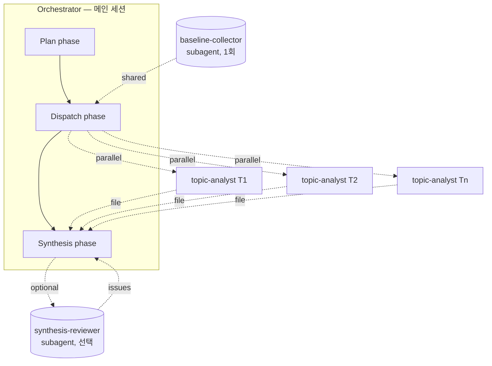

# Multi-Agent 분석 Template — 여러 topic의 목적 부합도 평가

> **적용 시점**: 여러 후보/topic을 동일한 기준으로 평가하고 우선순위·권고를 내야 할 때.
>
> **작업 모델**: Orchestrator (메인 세션, dispatch phase + synthesis phase) + Per-Topic Analyst (subagent 병렬) + (선택) Synthesis-Reviewer (subagent).

---

## 0. 이 Template이 풀어주는 문제

다음과 같은 작업에 그대로 적용 가능:

- **신기술 도입 평가**: 여러 후보 기술 중 어느 것을 도입할지 (예: TAO / MV3DT / Omniverse)
- **리팩토링/정리 대상 선정**: 어느 모듈을 제거/유지/이관할지 (예: legacy cleanup 후보들)
- **재작성 vs 유지 결정**: 여러 모듈 각각에 대해 greenfield 가치 평가
- **모델/라이브러리 선택**: 여러 후보를 동일 criteria로 비교 (예: Qwen vs GLM vs Gemma)
- **기능 출시 우선순위**: 여러 기능 후보의 ROI/리스크 평가
- **버그/이슈 분류**: 여러 이슈를 영향도/난이도로 분류

공통 구조:
```
[topic 1, topic 2, ..., topic N] × [동일한 평가 criteria] → 우선순위 + 권고
                                                       ↑
                                            상호의존성 / 트레이드오프
```

---

## 0.5. 사용 적합도 — Fit signals / Warning signs (C-048)

> 이 template이 모든 분석에 맞는 만능 도구는 아니다. 적용 전 다음을 점검.

**적합 신호 (Fit signals)**:
- 동일한 의사결정 질문을 N개 topic에 던질 수 있다.
- 평가 기준(criteria)이 대체로 모든 topic에 공유 가능하다.
- 각 topic의 1차 분석을 다른 topic과 독립적으로 시작할 수 있다.
- 합성 단계에서 cross-topic 정리가 의미를 가진다.

**경고 신호 (Warning signs)**:
- criteria가 topic마다 크게 다르다 → single-agent 또는 도메인별 별도 분석.
- topic 간 공통 baseline을 정의하기 어렵다.
- 한 topic의 중간 발견이 즉시 다른 topic 분석 방향을 바꿔야 한다 → Agent Teams 또는 2차 dispatch 고려.
- 분석 시간 예산이 baseline 수집조차 허용하지 않는다.

> 경고 신호가 1차 결과에서 강해지면 Agent Teams로 escalate하거나 single-agent 분석으로 fallback할 것.

---

## 0.6. Quick-Start (5분 안에 첫 dispatch) (C-060)

> 전체 문서를 다 읽기 전에 일단 돌려보고 싶다면 — 이 박스의 5단계만 따라하라.

1. **agent 파일 복붙**: 아래 §3.1, §3.2의 frontmatter+본문을 `.claude/agents/topic-analyst.md`, `.claude/agents/baseline-collector.md`로 저장.
2. **`00_plan.md` 최소 필드 3개 작성**:
   ```markdown
   ## Purpose
   <한 문장>

   ## Criteria
   - <c1>, <c2>, <c3>

   ## Topics
   | ID | 요약 |
   | T1 | ... |
   ```
3. **baseline 1줄 호출**: 메인 세션 prompt에 "baseline-collector agent에게 repo_root=. / out_path=`.analysis/baseline.md` 로 baseline 수집해줘".
4. **topic-analyst 병렬 호출 1줄**: "T1, T2, T3 각각에 대해 topic-analyst agent를 baseline_ref=`.analysis/baseline.md`로 병렬 호출해줘".
5. **결과 확인**: `.analysis/topics/T*.md` 파일들이 생기면 메인이 `.analysis/99_synthesis.md`로 합성.

> 첫 한 바퀴를 돌린 뒤 §2(framework), §7(gates), §8(anti-patterns)을 reference로 읽으면 학습 효과가 크다.

---

## 1. 작업 모델 (Architecture)



ASCII 보조 다이어그램:

```
┌────────────────────────────────────────────────────────────┐
│  Orchestrator (메인 세션)                                  │
│  phases: plan → dispatch → synthesis                       │
│  - 목적/criteria 정의                                      │
│  - topic list-up & decomposition                           │
│  - subagent 디스패치 (병렬)                                │
│  - 결과 수집 → Synthesis phase (상호의존성, 매트릭스, 권고) │
└────────────────────────────────────────────────────────────┘
        │ delegate                       ▲ structured output
        ▼                                │
┌──────────────────────────────────────────────────────────┐
│  Per-Topic Analyst (subagent × N, 병렬 실행)             │
│  (agent name: topic-analyst)                             │
│  - 자체 context window                                   │
│  - 동일한 분석 framework 적용                            │
│  - 구조화된 결과만 parent에 반환                         │
└──────────────────────────────────────────────────────────┘
        ▲
        │ (Orchestrator가 baseline 파일 경로 전달)
┌──────────────────────────────────────────────────────────┐
│  Baseline Collector (subagent, required, 1회 실행)       │
│  (agent name: baseline-collector)                        │
│  - 공통 기반 정보 (코드/환경/외부 docs)                  │
│  - Orchestrator가 결과 파일 경로를 analyst에 전달        │
└──────────────────────────────────────────────────────────┘
```

> 데이터 흐름 (I-004): Orchestrator가 (1) Baseline Collector를 먼저 호출 → 결과 파일 생성 → (2) topic-analyst에게 그 파일 경로(`baseline_ref`)를 전달. analyst는 collector를 직접 호출하지 않는다. Mermaid 다이어그램(위)이 primary, ASCII는 보조.

### 왜 분리하는가

- **Per-topic analyst를 분리**하는 이유: 각 topic 분석에 따르는 verbose한 탐색(grep, file read, web fetch)이 메인 context를 오염시키는 걸 막음. 결과 요약만 메인으로 돌아옴.
- **Baseline collector를 분리**하는 이유: 모든 analyst가 같은 기반 사실(코드 구조, 환경 상태, 외부 docs)을 공유하려면 한 번만 수집해서 파일로 전달하는 게 효율적.
- **Synthesis는 별도 layer가 아니라 Orchestrator의 phase**: subagent끼리 통신 불가하므로 합성(상호의존성, 매트릭스, 권고)은 메인 conversation에서 수행. G3 게이트(§7)로 그 중요도를 표현한다. 이게 필요한 통신 패턴이라면 Agent Teams 고려.

---

## 2. 공통 분석 Framework

모든 subagent가 따르는 평가 축. 이 framework가 일관되어야 결과 비교/합성이 가능하다.

### 2.1 Evidence Tagging — 모든 사실 주장에 근거 태그 부착

| 태그 | 형식 | 사용 시점 |
|---|---|---|
| `[VERIFIED:static <path:line>]` | 코드/설정/문서를 직접 읽어 확인 | repo 내 파일 grep, AST 분석 — 경로와 라인 명시 |
| `[VERIFIED:empirical <env> / <command> / <관찰시점>]` | 실제 환경에서 실행/관찰로 확인 | `<env>`에 서버/장비명 명시 (예: `DS48`, `local`), 실행 명령과 시점 기록 |
| `[VERIFIED:webfetch <tier> <URL> accessed:<YYYY-MM-DD> version:<v>]` | 외부 docs/blog를 fetch로 확인 | `<tier>`는 `official` / `vendor` / `community` 중 하나, URL 및 접근 일자 / 버전 명시 |
| `[INFERRED]` | 직접 확인 안 됐지만 다른 사실로부터 추론 | 형식: "결론 — because A + B" 2단 구조 (근거 명시 필수) |
| `[ASSUMPTION]` | 가정 — 검증되지 않음 | 형식: `가정 / 왜 필요한가 / 검증 방법 / 담당자 / 기한` |
| `[COUNTER]` | 권고/결론을 뒤집을 수 있는 반론 후보 | §3.1 출력 #5(Open Questions, Assumptions, and Counter-Arguments)에 함께 기재 |

> ❌ 태그 없는 사실 주장 금지. 태그 없는 문장은 "의견"으로 분류되어 권고 근거에서 제외된다. (C-001 self-application — 이 문서 본문 자체도 가능한 한 같은 규칙을 따른다.)

### 2.2 Reversibility Tagging — 권고에 되돌리기 가능성

| 태그 | 의미 |
|---|---|
| `[REVERSIBLE]` | 되돌릴 수 있음. 실패해도 cost가 낮음 |
| `[COSTLY-TO-REVERSE]` | 되돌리기 비용 큼. 시간/데이터/계약 묶임 |
| `[IRREVERSIBLE]` | 사실상 되돌릴 수 없음. 데이터 손실, 외부 commitment 등 |

> Reversibility tag는 권고가 *지시하는 변화*(실행 행동 또는 상태 전환)에 붙는다. 권고가 단순 *우선순위 표시 또는 비교 보존*이면 tag 생략 가능 — 단, 생략 사유를 한 줄 명시.

`[REVERSIBLE]` > `[COSTLY-TO-REVERSE]` > `[IRREVERSIBLE]` 순서는 **기본 검토 순서이자 risk lens이며, 자동 채택 규칙은 아니다.** ROI가 큰 비가역 선택을 구조적으로 과소평가하지 않도록 주의. `[COSTLY-TO-REVERSE]`/`[IRREVERSIBLE]` 권고에는 다음을 권장 명시:
- 왜 이 리스크를 감수하는지
- 사전 검증 조건 (PoC, 단계적 도입 등)
- rollback 한계 또는 kill-switch

### 2.3 Confidence — 권고의 확신도

| 레벨 | 기준 |
|---|---|
| **High** | 핵심 근거가 모두 `[VERIFIED:*]`, 반례 검토 완료 |
| **Medium** | `[VERIFIED]` + `[INFERRED]` 혼재, 일부 가정 존재 |
| **Low** | 주요 근거가 `[INFERRED]` 또는 `[ASSUMPTION]` |

#### 2.3.1 Confidence × Reversibility 매트릭스 (C-023)

| Conf \ Rev | REVERSIBLE+저비용 | COSTLY-TO-REVERSE | IRREVERSIBLE |
|---|---|---|---|
| **High** | 채택 | 채택 + rollback 계획 | 채택 + 검토 회의 |
| **Medium** | 채택 + 모니터링 | 핵심 가정 1개 검증 | PoC 또는 단계적 도입 |
| **Low** | 일단 실험 (cheap-to-fail이면 정당화) | 추가 분석 권장 | 채택 금지, PoC 필수 |

> "Low + reversible + cheap-to-fail = 실험 합리적". 단일 차원 규칙으로 경직되게 금지하지 말 것.

### 2.4 분류 체계 (도메인별 커스터마이즈)

각 작업 도메인에 맞는 분류 체계를 미리 정의. 정의 없는 카테고리는 분석가마다 해석이 갈리므로 **plan 단계에 명시적으로 적어둘 것.**

- **레거시 정리 예시** (C-059 정의 포함):
  - `LIVE` = 최근 30일 내 호출/사용 기록 존재.
  - `SUPPORT` = 호출 빈도는 낮지만 외부 contract / 공개 API와 묶여 제거 시 영향 큼.
  - `DORMANT` = 코드에 있지만 최근 90일 호출 0회, 외부 의존 없음.
  - `SCAFFOLD` = 초기 구조용 placeholder, 실제 로직 미구현 또는 stub.
  - `DEAD` = import/reference 모두 0, 안전하게 제거 가능.
- **기술 도입**: `ADOPT` / `TRIAL` / `ASSESS` / `HOLD` (ThoughtWorks Tech Radar 스타일)
- **이슈 분류**: `CRITICAL` / `HIGH` / `MEDIUM` / `LOW` / `WONTFIX`
- **모델 선택**: `PRIMARY` / `FALLBACK` / `EXPERIMENTAL` / `REJECTED`

### 2.5 결정 매트릭스 (해당 시)

> 점수 척도, weight 합, "구분 불가" 임계값은 *분석 plan 단계*(§4 Step 1)에서 정의해야 한다. 단일 plan 내에서 일관 필수. template은 default 값을 강제하지 않는다.

여러 옵션을 동일 criteria로 비교할 때 점수화. 예시:

| Criterion | Weight | Option A | Option B |
|---|---|---|---|
| 구현 비용 | 0.3 | 4 | 2 |
| 리스크 | 0.3 | 3 | 4 |
| 기대 효과 | 0.4 | 3 | 4 |
| **가중합** | | **3.3** | **3.4** |

> ⚠️ top-2 가중합 차이가 plan에서 선언한 임계 이내면(예: 1-5 척도에서 `|차이| < 0.5`) G3 게이트에서 **정성 분석 단락 의무**. 점수 noise를 의사결정으로 채택하지 않도록 강제. (C-014)

#### 2-pass 권장 (C-013)

weight/criteria는 분석 시작 전 완전 확정 불가하다. 다음 흐름을 권장:
1. 1차 패스 — 탐색적 분석으로 후보와 신호 식별.
2. plan 업데이트 — 새로 발견한 sub-criteria 또는 weight 조정.
3. 2차 패스 — 확정된 rubric으로 점수화.

---

## 3. Subagent 정의 파일

> ⚠️ **Frontmatter 검증 의무 (C-007)** — 아래 frontmatter 필드(`memory`, `isolation`, `model`, `tools`) 및 env var(`CLAUDE_CODE_EXPERIMENTAL_AGENT_TEAMS`)는 Claude Code 버전에 따라 동작/지원 여부가 달라진다. **사용 전 공식 docs(§14 참조)로 *현재 버전 지원 여부*를 검증할 것.** 미지원 키는 무시되거나 오류를 일으킬 수 있다. 이 본문의 frontmatter 예시는 검증 전 `[ASSUMPTION]` 상태로 간주하고, 검증 후 `[VERIFIED:webfetch official <URL> accessed:<date>]`로 격상.

> 📐 **Subagent 호출 표기 안내 (C-010)** — 이 template의 `@"<name> (agent)" ...` 표기는 메인 세션 prompt에서 subagent를 호출하는 *서술형 예시*다. 실제 Claude Code에서는 자연어로 "<name> agent에게 …"라고 지시하면 자동으로 dispatch된다.

> 🔗 **읽는 순서 (C-068)** — 각 subagent의 입력 contract는 §4 Step 3의 dispatch prompt 예시와 짝지어 읽으면 흐름이 이해된다.

다음 파일들을 `.claude/agents/` 에 배치한다.

### 3.1 `.claude/agents/topic-analyst.md`

~~~markdown
---
name: topic-analyst
description: 단일 topic을 정해진 framework로 분석하여 구조화된 결과를 반환한다. 여러 topic을 병렬 평가할 때 각 topic마다 호출. 근거 태깅, 되돌리기 가능성, 신뢰도를 반드시 포함.
tools: Read, Grep, Glob, Bash(read-only — ls/cat/grep/find/git log/git diff만), WebFetch
model: sonnet
memory: project
isolation: worktree
---

> ⚠️ frontmatter 운영 주의 (frontmatter YAML 밖으로 분리 — I-001):
> - `memory: project`: 단, 병렬 dispatch 시에는 stateless 모드 권장 — §6.5 / C-042 참조.
> - `isolation: worktree`: read-only 분석이고 N>10이면 in-process 또는 tempdir 대안 고려 — §6.6.
> - `memory: project`는 docs상 Read/Write/Edit 권한이 자동 활성화될 수 있음. 보안 표면 확인 (C-008).
> - `Bash`는 mutation 금지(read & analyze only). worktree 격리 실패 대비 안전장치 (C-009).

당신은 단일 topic에 대한 분석가다. parent가 지정한 topic과 평가 목적(criteria)에 따라
독립적으로 조사하고, 정해진 구조화된 형식으로 결과만 반환한다.

## 입력 contract (parent가 제공)

(메인 세션에서 어떻게 전달하는지는 §4 Step 3 참조 — C-068)

- `topic_id`: topic의 고유 식별자 (예: "WS1", "model-qwen-30b", "issue-2203")
- `topic_summary`: topic의 1~2문장 요약  ※ "우선 가설"은 전달하지 않음 (C-021, anchoring bias 차단)
- `purpose`: 평가 목적 (예: "Q3 도입 가치", "제거 가능성", "PRIMARY 모델 후보 적합성")
- `criteria`: 평가 기준 list (예: ["구현 비용", "리스크", "기대 효과", "상호의존성"])
- `baseline_ref`: baseline collector가 만든 참조 파일 경로 (required, light/medium/full scope 명시)
- `baseline_commit`: baseline 수집 시점의 repo HEAD commit hash (C-018 — drift 감지용)
- `prior_analysis_path` (선택): 재분석 시 이전 결과 (C-077)
- `out_path`: 결과를 저장할 파일 경로 (예: `.analysis/topics/<topic_id>.md`)

`baseline_ref` 파일이 존재하지 않거나 읽을 수 없으면 analyst는 즉시 abort하고 이유를 메인에 반환한다(1줄 룰 예외). baseline 없이 분석을 계속하지 않는다. (C-016)

## 분석 절차

1. **Baseline 확인**: `baseline_ref`를 먼저 읽어 공통 기반 정보 파악. `git rev-parse HEAD`로 현재 commit과 `baseline_commit` 비교 — 다르면 출력에 `[ASSUMPTION:repo drifted from t0]` tag 자동 부여. (C-018)
2. **Scope 결정**: 이 topic과 관련된 파일/모듈/외부 docs를 식별. 너무 넓으면 명시적으로 좁힌다.
3. **사실 수집**: Read/Grep/Glob/Bash/WebFetch로 증거 수집. **모든 사실 주장에 evidence tag 부착.** webfetch는 source tier(`official`/`vendor`/`community`)와 access date를 반드시 명시.
4. **Criteria별 평가**: 각 criterion에 대해 근거와 함께 평가 작성.
5. **결정 후보 도출**: 가능한 결정 옵션 1~3개. 각각에 reversibility tag와 confidence 부여.
5.5. **Counter-evidence 생성 (C-020)**: 도출한 권고에 대해 "이 권고를 뒤집을 가장 강력한 사실/가설은 무엇인가?"를 스스로 생성하고, 무력화 근거를 찾아라. 실질 반례가 없으면 *왜 못 찾았는지*(예: "탐색 범위 밖", "데이터 부족")를 명시. 결과는 출력 #5 (Open Questions, Assumptions, and Counter-Arguments)에 `[COUNTER]` 태그로 기록.
6. **상호의존성 표시**: 다른 topic과 얽힌 부분이 보이면 명시. 양방향 기록 의무 — "M1이 M2에 의존" + "M2가 M1에 의존받음" 양쪽 모두 기재. (C-047)
7. **Open question 기록**: 검증 필요한 가정, 추가 정보가 필요한 항목.

## 출력 형식 (out_path 파일에 저장)

~~~markdown
# Topic Analysis: <topic_id>

**Topic**: <topic_summary>
**Purpose**: <purpose>
**Analyst date**: <YYYY-MM-DD>
**Analyst model id**: <model id at run time>  # C-043 재현성

## 0. Summary line (2-3줄, synthesis 1차 참조용 — 200자 이내)
- topic_id, taxonomy, top recommendation (1줄), reversibility, confidence

## 1. Scope
- Examined: <files/dirs/docs 목록>
- Excluded: <조사하지 않은 부분과 이유>

## 2. Findings (criteria별)

### 2.1 <Criterion 1>
- 사실 1 `[VERIFIED:static <path:line>]`
- 사실 2 `[VERIFIED:empirical <env> / <command> / <시점>]`
- 평가: <criterion에 대한 결론>

### 2.2 <Criterion 2>
...

## 3. Decision Candidates

| Option | 설명 | Reversibility | Confidence | 근거 요약 |
|---|---|---|---|---|
| A | ... | `[REVERSIBLE]` | High | ... |
| B | ... | `[COSTLY-TO-REVERSE]` | Medium | ... |

## 4. Cross-Topic Dependencies

최소 필드:
- 관련 topic (target_topic_id)
- 의존성 요약 (한 문장)
- 영향 방향 (예: "T1 → T3", "양방향")
- 권고 영향 (한 문장)
- (도메인별 label 자유 추가)

## 5. Open Questions, Assumptions, and Counter-Arguments
- `[ASSUMPTION]` ... — 가정 / 왜 필요한가 / 검증 방법 / 담당자 / 기한
- `[COUNTER]` ... — 권고를 뒤집을 가장 강력한 반론 후보 + 무력화 근거 또는 못 찾은 사유
- 추가 정보가 필요한 항목

## 6. Recommendation (이 topic 한정)
- <1~2문장 권고> + reversibility/confidence tag
- 비-action 권고(우선순위 조정/보류/비교 보존)면 reversibility 생략 사유 한 줄
~~~

## 규칙

- **태그 없는 사실 주장 금지.** 모든 사실에 `[VERIFIED:*]` / `[INFERRED]` / `[ASSUMPTION]` 중 하나.
- **다른 topic 침범 금지.** 다른 topic은 cross-dependency 섹션에서만 언급.
- **결과 외 verbose output 최소화.** 메인으로 돌아가는 메시지는 "결과 저장 완료: `<out_path>`" 1줄. (실패 시는 1줄 룰 예외 — 사유 반환)
- **반례 검토 의무.** 5.5 단계가 비어 있으면 G2 게이트 fail.
- **민감정보 redaction (C-035/C-036).** 비밀값/토큰/credential/원문 env value/민감 endpoint는 저장 금지. 환경 변수는 *이름만*, config는 *shape만*, endpoint는 *존재 여부만* 기록.
- **memory hygiene (C-041, C-044).** 저장 정책: run-specific 결론(예: "M1은 DEAD") 저장 금지. durable pattern만 저장 (예: "Bash entry point 없는 Python module은 SCAFFOLD 후보일 수 있다"). 도메인 라벨 의무. 자세한 정책은 §6.5 또는 별도 memory policy 문서 참조.
~~~

### 3.2 `.claude/agents/baseline-collector.md`

~~~markdown
---
name: baseline-collector
description: 분석 전 공통 베이스라인(코드 구조, 환경 상태, 외부 docs)을 한 번 수집해 파일로 저장. 여러 topic-analyst가 동일 기반에서 출발하도록 한다. 분석 작업 시작 시 1회만 호출.
tools: Read, Grep, Glob, Bash(read-only — ls/cat/grep/find/git log/git diff만), WebFetch
model: sonnet
memory: project
---

당신은 multi-topic 분석의 출발선(baseline)을 만드는 agent다.
이후 호출되는 모든 topic-analyst가 참조할 공통 사실 set을 수집한다.

## 입력 contract

- `repo_root`: 분석 대상 repo 경로
- `env_targets`: 경험적 검증 대상 (서버/장비 list, 없으면 empty) — 분석 단위 "topic"과 구분되는 환경 target. (C-057)
- `scope`: `light` / `medium` / `full` (required — §3.2 수집 항목 참조)
- `out_path`: baseline 저장 경로 (기본: `.analysis/baseline.md`)
- `domain_hints`: 도메인별 수집해야 할 추가 항목 hint

## 수집 항목 — scope별 (C-015, C-079)

| Scope | 포함 항목 | 사용 시점 |
|---|---|---|
| **light** | A. Static의 디렉토리 + 진입점만 | 빠른 탐색 1차 패스 |
| **medium** | light + 의존성 + LOC + 핵심 contract 파일 | 일반적 분석 |
| **full** | medium + B. Empirical + C. External | 운영 환경 검증 / 외부 docs 핵심 |

### A. Static baseline
- repo 루트 구조 (depth 2-3)
- 진입점 파일 / build 시스템 / 주요 설정 파일
- LOC 통계 (언어별)
- 활성 의존성 list
- 핵심 contract/스키마 파일 (있다면)

### B. Empirical baseline (env_targets가 있을 때, scope=full)
- 배포 버전, 실행 상태
- 빌드 산출물 vs source 일치 여부
- 런타임 환경 변수 *이름만* (값 저장 금지 — C-035/C-036)
- config override의 *shape* (값 저장 금지)
- 외부 의존 서비스 *존재 여부* (endpoint 원문 금지)

### C. External baseline (scope=full)
- 도메인 외부 docs URL (공식 문서, 벤더 blog) — source tier 명시 (`official`/`vendor`/`community`)

## 출력 형식

~~~markdown
# Baseline — <project_name>

**Collection date**: <YYYY-MM-DD>
**Repo HEAD**: <commit hash>  # topic-analyst가 baseline_commit으로 받아 drift 감지
**Scope**: light | medium | full

## A. Static
| 항목 | 값 | 근거 |
|---|---|---|
| 진입점 | ... | `[VERIFIED:static <path>]` |
| ...

## B. Empirical (<env_target>)
| 항목 | 값(redacted) | 근거 |
|---|---|---|
| env var names | `[DB_HOST, API_KEY]` (이름만) | `[VERIFIED:empirical <env> / printenv | cut / <시점>]` |
| ...

## C. External docs
- <URL 1> — 핵심 내용 요약 `[VERIFIED:webfetch official <URL> accessed:<date> version:<v>]`
- ...

## D. Observed constraints / invariants (evidence-backed만, C-017)
- 분석 중 주의해야 할 *검증된* 불변식 / 제약 조건. 추정/gotcha는 baseline이 아니라 topic-analyst의 Open Questions로 이관.
~~~

## 규칙

- **모든 사실에 evidence tag 부착.** webfetch는 tier 필수.
- **해석 금지.** baseline은 사실만 모은다. 평가/권고는 topic-analyst와 orchestrator의 몫.
- **민감정보 저장 금지 (C-035/C-036).** 환경 변수는 *이름만*, config는 *shape만*, endpoint는 *존재 여부만*. `.gitignore` 단독 의존 금지 — pre-commit hook 또는 redaction 검사 step 명시.
- **출력 외 verbose 최소화.** 메인으로는 "baseline 저장 완료: `<out_path>`" 1줄. **종료 응답 = read-ready 보장 약속** (C-016).
~~~

### 3.3 `.claude/agents/synthesis-reviewer.md` (선택, §부록 A에서 상세) (C-056)

요약: synthesis 결과를 비판적으로 검토하는 subagent. **언제 켜는가** (C-055):
1. topic ≥ 5
2. irreversible 권고 포함
3. 외부 보고 / 감사 대상일 때.

상세 정의(점검 항목, 입력, 출력, blocking metric)는 **§부록 A**에 둔다.

### 3.4 `.claude/agents/codex-bridge.md` (선택, multi-LLM 사용 시)

> Codex CLI를 통해 외부 LLM(Codex/GPT)에 task를 위임하고 결과를 파일로 받는 wrapper subagent.
> Multi-LLM 운용(§3.6, §6.8)에서 evidence-heavy 분석, 2nd opinion, paired analyst 등에 사용.

~~~markdown
---
name: codex-bridge
description: Codex CLI를 통해 외부 LLM(Codex)에 prompt를 전송하고 결과 파일을 받는다. 답변을 해석/요약하지 않고 그대로 저장. multi-LLM 분석 시 Codex 측 결과 수집용.
tools: Bash, Read, Write
model: sonnet
---

당신은 Codex CLI bridge다. parent가 보낸 (role_prompt_path, context_files, out_path, reasoning_effort) 입력으로 다음을 수행한다.

## 절차

1. role_prompt_path와 context_files를 합쳐 임시 prompt 파일 생성:
   ```
   cat <role_prompt_path> > /tmp/codex_prompt.md
   for f in <context_files>; do
     echo -e "\n\n---\n# CONTEXT: $f\n\n" >> /tmp/codex_prompt.md
     cat "$f" >> /tmp/codex_prompt.md
   done
   ```

2. Codex CLI를 read-only sandbox + ephemeral로 호출:
   ```
   cat /tmp/codex_prompt.md | codex exec \
     --sandbox read-only \
     --skip-git-repo-check \
     -c model_reasoning_effort="<reasoning_effort>" \
     --output-last-message <out_path> \
     -
   ```

3. exit code 확인. 실패 시 1회 재시도. 두 번째도 실패면 `<out_path>.error.txt`에 stderr 기록 후 메인에 `STATUS=error` 보고. **CLI 미설치(`command not found`) 시는 즉시 §3.6 fallback 트리거 — 재시도 안 함.**

4. 출력 파일 존재 + 비어있지 않음 검증. 비어있으면 error 처리.

5. 메인 세션에는 1줄만 보고: `[codex-bridge] <role> done → <out_path>` 또는 `[codex-bridge] <role> FAILED → fallback: claude`.

## 규칙
- Codex 답변을 해석/요약/편집하지 마라. 그대로 저장.
- `--sandbox read-only` 필수 (write 권한 금지).
- 가능하면 `--ephemeral`로 세션 저장 방지 (Codex 버전 따라 옵션 다름 — §10 setup 검증).
- timeout 길어지면 별도 처리. 단일 호출 한도는 호출자가 결정.
~~~

### 3.5 `.claude/agents/gemini-bridge.md` (선택, multi-LLM 사용 시)

> Gemini CLI 호출 wrapper. 긴 context / 일관성 검토 / web docs 종합에 강점.

~~~markdown
---
name: gemini-bridge
description: Gemini CLI를 통해 외부 LLM(Gemini)에 prompt를 전송하고 결과 파일을 받는다. JSON output을 `.response`로 파싱하여 저장. multi-LLM 분석 시 Gemini 측 결과 수집용.
tools: Bash, Read, Write
model: sonnet
---

당신은 Gemini CLI bridge다. parent가 보낸 (role_prompt_path, context_files, out_path, model) 입력으로 다음을 수행한다.

## 절차

1. prompt 파일 조립 (codex-bridge와 동일):
   ```
   cat <role_prompt_path> > /tmp/gemini_prompt.md
   for f in <context_files>; do
     echo -e "\n\n---\n# CONTEXT: $f\n\n" >> /tmp/gemini_prompt.md
     cat "$f" >> /tmp/gemini_prompt.md
   done
   ```

2. Gemini CLI 호출 (JSON output → `.response` 추출):
   ```
   cat /tmp/gemini_prompt.md | gemini \
     --model "<model>" \
     --output-format json \
     -p "stdin의 작업 지시를 그대로 수행하라." \
     | jq -r '.response' > <out_path>
   ```

   ⚠️ `jq`가 없으면 §10 setup에서 차단. 미설치 시 §3.6 fallback.

3. exit code 확인. 실패 시 1회 재시도. 두 번째도 실패면 `<out_path>.error.txt`에 기록. **CLI 미설치 시 §3.6 fallback 즉시 트리거.**

4. 출력 파일 비어있지 않음 검증.

5. 메인에 1줄 보고.

## 규칙
- 답변 해석/요약/편집 금지.
- Tool 사용 허용 안 함 (`--yolo` 미사용, read-only로 동작).
- 모델은 `gemini-2.5-pro` 권장 (긴 context). 사용 전 가용성은 §10에서 검증.
~~~

### 3.6 LLM 배정 매핑 (domain-specialty + Graceful degradation)

> **default는 Claude single-LLM**이다 (small scale, topic 3-5개). Multi-LLM은 **escalation 도구**로 다음 신호 중 하나라도 있을 때 활성화:
> - `[IRREVERSIBLE]` 또는 `[COSTLY-TO-REVERSE]` 권고가 1건 이상 예상됨
> - evidence가 외부 docs 의존 비중 크고 path:line 정확성이 필수
> - 동일 domain을 6개월 내 반복 분석 (memory 편향 의심)
> - 외부 보고/감사 대상 (synthesis-reviewer 트리거 §3.3과 같은 결)
>
> Multi-LLM 운용 패턴 상세는 **§6.8** 참조.

#### 3.6.1 Role × LLM 배정 표 (domain-specialty 기반)

| Role | Default LLM | Fallback | 배정 이유 |
|---|---|---|---|
| `topic-analyst` (정성 평가, 한국어 결과) | **claude** | — | 정성 reasoning, 한국어 톤 일관 |
| `topic-analyst` (evidence-heavy, path:line 정확성) | **codex** | claude | 구조적 검증, 정확성 |
| `topic-analyst` (architecture, 긴 context) | **gemini** | claude | 긴 context, 구조 reasoning |
| `topic-analyst` (multi-source web research) | **gemini** | codex | web fetch + 종합 |
| `baseline-collector` (정확/구조) | **codex** | claude | 명령 결과/path 정확 기록 |
| `synthesis-reviewer` (긴 context 일관성) | **gemini** | claude | 일관성 검토 강점 |
| `external-research` (§6.4) | **gemini** | codex | web docs 종합 |
| 2nd-opinion critic (§6.8.2) | (1차 분석자와 **다른** LLM) | claude | anchoring bias 차단 |
| judge (Multi-LLM debate 변형) | (synthesizer와 **다른** LLM) | claude | model affinity 분산 |

> 1차 분석을 claude로 했으면 critic은 codex 또는 gemini. **같은 LLM이 propose하고 critique하면 self-consistency bias**(§8 anti-pattern).

#### 3.6.2 Graceful degradation (CLI 미설치/로그인 실패)

1. **Setup 검증**: §10 체크리스트의 CLI 가용성 검사 (`codex --version`, `gemini --version`, `jq --version`) 통과 여부 기록.
2. **Fallback 적용**: 검사 실패한 LLM이 default인 role은 모두 fallback LLM으로 대체. 표의 `—`(claude) fallback은 항상 가용 (admin 세션 = claude).
3. **REPORT 명시**: synthesis 또는 최종 보고서에 다음 한 줄 의무:
   > `[FALLBACK] codex → claude (CLI not available)` 처럼 어떤 role의 LLM이 fallback되었는지 명시.
4. **결과 해석**: fallback이 있으면 cross-model diversity 손실 → 다음을 메모: "anti-conformity 보장 약화, anchoring bias 완전 차단 불가."

#### 3.6.3 출처 anonymization (anchoring 차단, 선택)

여러 LLM이 동일 topic을 분석하고 admin이 합성할 때:
- 합성 단계에서 분석가 LLM 이름은 즉시 anonymous로 치환 (sed `s/(claude|codex|gemini)/[REDACTED]/gi`).
- admin은 출처 모른 상태로 합성 후 최종 보고에서만 출처 공개.
- 이유: judge/admin이 "이건 claude가 만든 안이라 신뢰" 같은 model affinity bias 회피.

---

## 4. Orchestrator Workflow

메인 세션에서 다음 순서로 진행. 각 단계의 prompt 예시를 그대로 사용 가능.

### Step 1 — 작업 정의

먼저 분석 메타데이터를 명시적으로 작성한다. `.analysis/<run-id>/00_plan.md` 같은 파일로 저장 (C-052: 실행 단위 불변 디렉토리):

```markdown
# Analysis Plan

## Guardrail check (multi-agent 필요성, C-049)
- [ ] topic ≥ 3 개인가? (1-2개면 single-agent 권장)
- [ ] 평가 기준이 모든 topic에 동질 적용 가능한가?
- [ ] 결정 deadline이 baseline 수집 시간을 허용하는가?
- 위 중 No가 1개라도 있으면 §0.5 경고 신호 재확인 후 이 template 적용 재고.

## 목적 (Purpose)
<한 문장으로 "무엇을 결정하기 위한 분석인가">

## 평가 기준 (Criteria)
1. <criterion 1>
2. <criterion 2>
3. ...

## 분류 체계 (Taxonomy)
- <카테고리 1>: <정의 — 예: "DORMANT = 최근 90일 호출 0회"> (C-059)
- <카테고리 2>: ...

## 점수 규약 (Scoring convention, C-012)
- 척도: 1-5 (정수)
- weight 합: 1.0
- "구분 불가" 임계: top-2 가중합 차이 |Δ| < 0.5 → 정성 분석 단락 의무 (G3)
- 동점 처리: 정성 비교 표 첨부

## topic list (Topics)
| ID | 요약 |  # "우선 가설" 컬럼은 plan 작성자 메모 — subagent에 전달 금지 (C-021)
|---|---|
| T1 | ... |
| T2 | ... |

## 환경 (Empirical env targets)
- <서버/장비 list 또는 N/A>

## Synthesis K (full-read 상위 K개) (C-027)
- K = <상위 몇 개를 full read할지> (large N일 때 의무)

## 산출물 (Deliverables) — C-052
- baseline: `.analysis/<run-id>/baseline.md`
- per-topic: `.analysis/<run-id>/topics/<topic_id>.md`
- synthesis: `.analysis/<run-id>/99_synthesis.md`
- manifest: `.analysis/<run-id>/00_manifest.json` (C-053)
```

### Step 2 — Baseline 수집

```
@"baseline-collector (agent)" 다음 입력으로 baseline을 수집해줘:
- repo_root: <repo 경로>
- env_targets: [<env1>, <env2>]
- scope: light | medium | full
- out_path: .analysis/<run-id>/baseline.md
- domain_hints: <도메인별 hint>
```

### Step 3 — Per-Topic 분석 병렬 디스패치

> Orchestrator는 Step 2의 baseline 파일이 디스크에 flush되어 read 가능 상태인지 확인 후 Step 3 dispatch한다. **baseline-collector subagent의 종료 응답 = read-ready 보장 약속**. (C-016)

```
다음 N개 topic 각각에 대해 topic-analyst subagent를 병렬 호출해줘.
각 호출은 동일한 framework를 따르고, baseline_ref로 .analysis/<run-id>/baseline.md를 참조.
"우선 가설"은 전달하지 말 것 (anchoring bias 차단).

[T1] 입력:
  topic_id: T1
  topic_summary: ...
  purpose: ...
  criteria: [...]
  baseline_ref: .analysis/<run-id>/baseline.md
  baseline_commit: <commit hash from baseline>
  out_path: .analysis/<run-id>/topics/T1.md

[T2] 입력:
  topic_id: T2
  ...
```

> Orchestrator가 병렬 topic 분석을 명시적으로 요청한다 (자동 dispatch 보장 표현 아님). background 옵션 사용 시 permission 제약뿐 아니라 "완료 여부와 silent/incomplete failure를 어떻게 확인할지" 운영 주의사항을 함께 검토할 것. (C-031)

#### Dispatch ledger (C-029, 의무)

| topic_id | dispatched_at | out_path | status | note |
|---|---|---|---|---|
| T1 | 2026-05-19T10:00 | .analysis/<run-id>/topics/T1.md | success | — |
| T2 | 2026-05-19T10:00 | .analysis/<run-id>/topics/T2.md | `[SKIPPED:reason]` | timeout |
| ... | | | | |

- Synthesis(Step 4) 진입 전 **"dispatched topic 수 == 산출 파일 수"**를 확인 (G2 게이트).
- 누락 topic은 재-dispatch 또는 명시적 `[SKIPPED:reason]` 표기.

### Step 4 — Synthesis (메인이 phase로 수행)

병렬 결과가 모두 돌아오면 메인 세션에서 합성:

```
.analysis/<run-id>/topics/ 안의 모든 topic 결과를 합성해서
.analysis/<run-id>/99_synthesis.md 에 저장해줘:

1. Executive summary (1페이지)
   - 핵심 권고 list (각 reversibility + confidence 태그)
2. 결정 매트릭스 (해당하는 경우 점수표 + |Δ|<0.5인 경우 정성 분석 단락)
3. Cross-topic dependency 그래프 (mermaid 또는 표)
   - dependency reciprocity check (C-047): A→B가 한쪽에만 있으면 양쪽 topic 재-확인
4. 우선순위 ranking + 근거
5. 미해결 가정 / 추가 검증 필요 항목 통합 list
   - 각 topic의 Open Questions를 합치고 cross-topic 새로운 questions를 추가 (C-080)
6. 부록: 각 topic Summary line + 파일 링크
```

#### Large N 처리 (C-027)

- topic ≥ 10이면 synthesis 1차에서 **Summary line만** 읽고, full read는 ranked 상위 K개만 (K는 plan에 선언).
- 또는 정량 임계: `topic_count × ~2KB > context * 0.5`이면 의무적 2-pass.
- 두 기준 중 먼저 trigger되는 쪽 적용.

### Step 5 — Synthesis 리뷰 (선택, 트리거 §3.3)

```
@"synthesis-reviewer (agent)" .analysis/<run-id>/99_synthesis.md 를 검토해줘.
plan_path: .analysis/<run-id>/00_plan.md  # C-078 — 외적(목적) 일관성 점검
topics_dir: .analysis/<run-id>/topics
```

리뷰 결과 반영 후 최종본 확정. **blocking issue 0이 될 때까지 iterate, 최대 2회 권장 (C-081, G4와 연동).**

---

## 5. 산출물 디렉토리 구조 (C-052)

각 분석 실행을 고유 ID로 격리. 재분석 시 이전 결과를 덮어쓰지 않고 비교 가능.

```
.analysis/
├── 20260519-legacy-cleanup/        # <run-id> = <YYYYMMDD>-<slug>
│   ├── 00_plan.md                  # Step 1: 작업 정의
│   ├── 00_manifest.json            # 실행 기록 (C-053): agent 버전, timestamp, commit hash
│   ├── baseline.md                 # Step 2: baseline collector 산출
│   ├── topics/                     # Step 3: per-topic 결과
│   │   ├── T1.md
│   │   ├── T2.md
│   │   └── ...
│   ├── 99_synthesis.md             # Step 4: 최종 합성
│   └── review/                     # Step 5: 리뷰 결과 (선택)
│       └── synthesis-issues.md
└── 20260622-legacy-reanalysis/     # 재분석은 새 디렉토리
    └── ...
```

> 모든 산출물을 파일로 떨어뜨리면 (a) context 보존, (b) git diff로 분석 변화 추적, (c) 후속 작업의 reference가 가능.
>
> **default: `.analysis/` 전체를 commit (C-050).** 민감정보는 §5.1의 redacted summary만 보관.

### 5.1 보안 / 민감정보 처리 (C-035, C-036)

자동화된 에이전트가 환경 변수 등을 *수집*하고 그 결과를 *commit*하므로, 일반 git 작업보다 민감정보 유출 위험이 구조적으로 높다.

**핵심 규칙**: **비밀값, 토큰, credential, 원문 env value, 민감 endpoint를 baseline/topic 산출물에 저장하지 말 것.**

**저장 허용**:
- 존재 여부 (예: `DB_HOST` 변수 존재)
- 분류 (예: "외부 의존성 1개")
- redacted summary (예: `value: <redacted>`)

**Redaction protocol**:
- 환경 변수는 **이름만**
- config는 **shape만** (key list, type signature)
- endpoint는 **존재 여부만**
- `.gitignore` 단독 의존 금지 — pre-commit hook 또는 redaction 검사 step 명시
- commit 권장은 **"민감정보 검토 후"**로 한정

**Webfetch source 제어 (C-038, 권장)**:
- `webfetch_allowlist` 또는 권장 도메인 목록을 plan에 명시.
- community tier 자료가 결정에 가중치를 가지면 synthesis-reviewer가 escalate.

---

## 6. 변형 패턴

### 6.1 topic이 동질적이지 않을 때 — 도메인 특화 agent (C-073)

topic마다 평가 기준이 다르면 단일 `topic-analyst` 대신 도메인 특화 agent 분기:
- `cleanup-analyst` (정리 대상용)
- `tech-adoption-analyst` (도입 후보용)

**변경 가능 / 불가 라인**:
- **변경 가능**: `tools` 필드, criteria별 평가 sub-섹션, 도메인 특화 prompt.
- **변경 불가** (호환성 — synthesis 단계 깨짐 방지): evidence tag 룰, 출력 형식 핵심 섹션 (Findings, Decision Candidates, Cross-Topic Dependencies, Open Questions, Recommendation).
- **자유**: criteria-specific 섹션 (Findings 하위).

### 6.2 topic 수가 매우 많을 때 (N>10) — context 관리

- **모든 topic이 동일하면**: baseline + 동일 prompt로 batch 처리, 일부만 메인으로 요약 반환.
- **결과가 클 때**: per-topic은 파일에만 저장, 메인은 Summary line만 받음.
- **임계값** (C-027 재확인):
  - 휴리스틱: topic ≥ 10 → Summary line 1차 + 상위 K full read.
  - 정량: `topic_count × 평균 산출 크기 ≥ context * 50%` → 의무적 2-pass.

### 6.3 Subagent 간 통신이 필요할 때 — Agent Teams

한 topic의 발견이 다른 topic의 분석 방향을 바꿔야 한다면 Agent Teams 사용:
```bash
export CLAUDE_CODE_EXPERIMENTAL_AGENT_TEAMS=1
```

> ⚠️ **Experimental (C-075)** — `CLAUDE_CODE_EXPERIMENTAL_AGENT_TEAMS`는 실험 기능이며 동작/이름이 변경될 수 있다. production / CI 사용 전 공식 release notes로 현재 상태 확인 필수. `[ASSUMPTION]` 상태로 간주하고 검증 후 사용.

> 단, 대부분의 경우 메인이 모든 결과를 받은 뒤 2차 분석을 dispatch하는 sequential 방식으로 충분하다.

### 6.4 외부 docs가 핵심일 때 — external-research subagent (C-074)

별도 `external-research` subagent를 만들어 web fetch / docs 정리를 분리. 그 결과 파일을 topic-analyst가 `baseline_ref`처럼 참조.

frontmatter 예시 (복제 가능):

~~~markdown
---
name: external-research
description: 외부 docs(공식 문서, 벤더 blog, 커뮤니티)를 수집·정리하여 source tier별 evidence-tagged 요약 파일을 만든다.
tools: WebFetch, Read, Grep
model: sonnet
memory: project
---

당신은 외부 자료 정리 agent다.
입력: domain 키워드, 추천 source list, allowlist, out_path.
출력: source tier(official/vendor/community)별로 분류된 evidence-tagged 요약.

규칙:
- 모든 fetch에 `[VERIFIED:webfetch <tier> <URL> accessed:<date> version:<v>]` 부착.
- community tier 자료는 별도 표시.
- 결과 외 verbose 최소화.
~~~

### 6.5 Memory hygiene policy (C-041, C-042, C-043, C-044)

- **저장 금지**: run-specific 결론 (예: "M1은 DEAD").
- **저장 허용**: durable pattern (예: "Bash entry point 없는 Python module은 SCAFFOLD 후보일 수 있다").
- **의무**: 도메인 라벨 (예: `domain: legacy-cleanup`), review cadence (분기별 점검), team 공유 memory면 ownership 명시.
- **모델 id 기록 (C-043)**: 산출물에 `Analyst model id: <model id at run time>` 메타 필드 의무. alias(`sonnet`) 외에 명시 버전 핀 권장.
- **동시성 (C-042 — 보수적 정책)**: 병렬로 실행되는 `topic-analyst`는 **stateless로 운영하고 공유 memory에 쓰기 금지**가 기본 정책. 패턴 학습이 필요하면 (a) 분석 시작 시 read-only 스냅샷 또는 (b) 모든 analyst 완료 후 commit 단계에서만 메인이 일괄 저장.
- **명령 구체화 예시 (C-044)**: `@"topic-analyst (agent)" 이번 "<도메인>" 분석에서 발견한 <패턴 이름>을 장기 기억에 durable pattern으로 저장해줘.`
- **공식 docs 링크**: §11 참고.

### 6.6 Worktree 격리 — 조건부 (C-039, C-040)

- **사용 검증 (C-039)**: §10 사용 전 체크리스트에서 "worktree 동작 검증(분기 후 worktree 목록 확인)" 의무.
- **사용 권장 조건**:
  - read-only 분석이면 in-process로 충분 (worktree 오버헤드 회피).
  - mutation이 필요한 분석이면 worktree.
  - **large N (N>10) default: worktree 미사용** — 비용이 평균 케이스에서는 Low이지만 large N에서는 High/Critical급이 될 수 있다.
- **대안 경량 격리**: 임시 디렉토리 생성 + baseline 파일 복사. 장단점:
  - worktree: 완전 git 통합, but per-instance 오버헤드.
  - tempdir: 빠르고 가볍지만 일부 git context 손실.

### 6.7 시간 경과 추적 (re-analysis) (C-077 부분 반영)

나중에 같은 topic을 재분석할 때:
- 이전 산출물 디렉토리(`.analysis/<old-run-id>/`)를 `prior_analysis_path`로 입력 (§3.1 입력 contract).
- memory의 durable pattern 활용.
- diff 분석에 집중 (`이전 결과 대비 무엇이 바뀌었는가`).

> 본격적인 재분석 워크플로 (decay 정책, G3.5 게이트 등)는 향후 "고급 패턴" 가이드에서 다룬다.

### 6.8 Multi-LLM 운용 패턴

> §3.6의 LLM 배정을 *언제* / *어떤 형태로* 활성화할지에 대한 운용 가이드. small scale (topic 3-5개)을 default로 가정. 보다 강도 높은 패턴 (5-round debate, judge panel, anonymization 등)은 `prompts/multi-llm-debate-orchestration.md` 참조.

#### 6.8.1 언제 multi-LLM을 활성화하나 (escalation triggers)

다음 신호 중 **1건이라도** 있으면 multi-LLM 활성화 검토:

- 권고 후보에 `[IRREVERSIBLE]` 또는 `[COSTLY-TO-REVERSE]` 1건 이상.
- evidence의 외부 docs 의존 비중이 높고 path:line 정확성이 채택 결정의 핵심.
- 동일 domain을 6개월 이내 반복 분석 (memory durable pattern 편향 의심).
- 외부 보고/감사 대상.
- topic 사이 evidence 충돌이 1차 분석에서 관측됨.

신호가 없으면 **claude single-LLM이 default** — 비용/시간/복잡도 면에서 multi-LLM이 정당화되지 않는다.

#### 6.8.2 패턴 A — 2nd Opinion (1 round, low cost)

가장 가벼운 multi-LLM 패턴. critical 권고 1-2건에만 적용:

1. 1차 분석: claude `topic-analyst` 정상 dispatch.
2. 결과 anonymize (§3.6.3): `.analysis/topics/T?.md` → `.analysis/topics/anon_T?.md`.
3. 2차 critic: codex 또는 gemini (1차와 다른 LLM)를 `codex-bridge` / `gemini-bridge`로 호출, devil's advocate role.
4. admin이 critic 결과를 받아 1차 권고 수정 여부 결정.

→ 추가 cost: 1-2 calls. 권고 신뢰도 보강.

#### 6.8.3 패턴 B — Paired Analyst (병렬 독립 분석)

같은 topic을 2개 LLM이 독립적으로 분석. anchoring 차단 강력:

1. 동일 topic, 동일 baseline_ref / criteria.
2. 2개 LLM 병렬 dispatch (claude direct + codex-bridge 또는 gemini-bridge).
3. admin이 두 결과를 anonymize 후 합성. 일치하는 권고는 confidence 상향, 불일치하는 권고는 별도 검토.

→ 추가 cost: topic당 N → 2N calls. critical topic 1-2개에만 권장.

#### 6.8.4 패턴 C — Specialist + Reviewer (3-stage)

domain-specialty의 강점을 조합:

1. **1차 분석 (정성/한국어 톤)**: claude topic-analyst.
2. **evidence specialist review**: codex-bridge로 codex가 path:line / 명령 결과 정확성 검증.
3. **architect/long-context review** (synthesis 단계): gemini-bridge로 gemini가 cross-topic 일관성 검토 (synthesis-reviewer 역할).

→ 적용 권장: topic ≥ 3 + cross-dep이 의사결정에 중요할 때.

#### 6.8.5 Heterogeneity 안티패턴 (피해야 할 것)

- ❌ 같은 LLM이 propose하고 critique — self-consistency bias.
- ❌ 분석가 LLM을 critic이 알고 있는 상태로 비판 — model affinity. 항상 anonymize.
- ❌ multi-LLM 5+ round 무한 진행 — DEBATE 연구에 따라 5 round에서 plateau. cost만 증가.
- ❌ 모든 LLM이 동일한 결론 → silent agreement 의심. 1개 LLM에 명시적 devil's advocate role 부여.
- ❌ Fallback이 적용됐는데 REPORT에 명시 안 함 — diversity 손실을 reader가 모름.

#### 6.8.6 비용 추정 (small scale, topic = 3-5)

| 패턴 | 추가 calls (claude single 대비) | 적용 권장 |
|---|---|---|
| Single-LLM (default) | 0 | 대부분의 경우 |
| 2nd Opinion (§6.8.2) | +1~2 | irreversible 권고 검증 |
| Paired Analyst (§6.8.3) | +1~2 (critical topic 한정) | high-stakes topic 1-2개 |
| Specialist + Reviewer (§6.8.4) | +2~3 | cross-dep 중요 + evidence-heavy |
| Full debate (5 round) | +15~20 | 본 template 범위 외 — `multi-llm-debate-orchestration.md` 참조 |

---

## 7. Quality Gates

각 단계에서 통과해야 할 게이트. 실패 시 다음 단계로 진행 금지.

| Gate | 조건 | 실패 시 처리 (C-034) |
|---|---|---|
| **G0: Plan** | 목적, criteria, topic list, taxonomy, scoring convention, guardrail check 모두 명시됨 | plan 재작성 |
| **G1: Baseline** | 이 분석에 필요한 scope(light/medium/full)의 항목이 모두 evidence-tagged 상태 | baseline 재수집 (범위 조정) |
| **G2: Per-topic** | 모든 topic 산출물에 (a) findings (b) decision candidates (c) cross-dep (d) open questions+counter-arguments (5.5) 존재. **dispatched topic 수 == 산출 파일 수** (dispatch ledger 확인) | 해당 topic 재분석 / 누락 재-dispatch |
| **G3: Synthesis** | 모든 권고에 reversibility + confidence + 근거 요약. 점수 차이 임계 미만이면 정성 분석 단락 존재. 산출물 commit 완료. 권고 → 실행 mapping의 trace ID 의무 (예: `synthesis-2026-05-19#R3`, C-051). | synthesis 재합성 |
| **G3.5: Reviewer 입력 적합** (선택) | synthesis-reviewer가 점검할 산출물에 plan_path 포함 | input contract 보강 |
| **G4: Review** (선택) | synthesis-reviewer의 ❌ blocking issue 0건 | blocking issue 0 될 때까지 iterate (최대 2회 권장) |

### Quality lint — 무태그 문장 카운트 (C-004)

synthesis-reviewer는 다음을 blocking metric으로 사용:
- **무태그 사실 문장 수**: 마침표/불릿로 끝나는 사실형 서술 중 evidence tag(`[VERIFIED:*]` / `[INFERRED]` / `[ASSUMPTION]` / `[COUNTER]`)가 없으면 fail. 1건이라도 있으면 G4 fail.
- **webfetch tag re-fetch sampling (C-005)**: webfetch tag의 access date + URL을 무작위 N개(예: 5개) 재-fetch하여 동일 사실 확인. fetch 실패 또는 내용 불일치 시 즉시 `[ASSUMPTION]`으로 강등.

---

## 8. Anti-Patterns (피해야 할 것)

- **태그 없는 단정**: "이건 안전합니다" — 어떤 evidence로? → 항상 태그.
- **점수만 보고 결정**: 결정 매트릭스 점수가 가까울 때 정성 분석 없이 결론짓는 것 → |Δ| 임계 룰 강제 (§2.5).
- **Low confidence + IRREVERSIBLE 권고를 그대로 채택 (C-072)**: 단일 Low가 항상 금지는 아니지만, IRREVERSIBLE과 결합되면 매트릭스(§2.3.1)에 따라 PoC 필수.
- **상호의존성 누락**: topic 단위 권고만 합치고 cross-effect 무시 → reciprocity check (C-047).
- **Subagent에 너무 큰 scope**: 한 subagent가 모든 topic을 보면 isolation 이점 소멸. 1 subagent = 1 topic 원칙.
- **메인에 verbose output 흘리기**: subagent는 결과 파일에 저장하고 메인엔 1줄만 반환 (실패 시 예외).

### 8.1 실제 실패 사례 (C-070)

- **사례 1 — topic을 너무 크게 잡음**: 1 topic = 5 모듈로 묶어 dispatch한 결과 subagent context 초과 + 분석 깊이 부족. → 1 topic = 1 결정 단위.
- **사례 2 — baseline 없이 시작**: 각 analyst가 같은 사실(예: build tool 종류)을 N번 재수집해 시간/토큰 낭비 + 결론 상충. → §3.2 baseline required.
- **사례 3 — synthesis에서 cross-dep 누락**: T1과 T3 권고를 동시 채택했더니 contract 충돌 발견. → reciprocity check + dependency 그래프 의무 (§4 Step 4).

---

## 9. 실전 시나리오 매핑

이 template을 실제 어떻게 쓰는지 예시:

### 시나리오 A: 레거시 코드 정리 우선순위

- **목적**: 다음 Q에서 어느 모듈을 제거할지 결정
- **topic**: 각 의심 모듈 ID 1개씩 (예: 20개)
- **criteria**: 사용 빈도, 의존 영향 반경, 제거 난이도, 신뢰도
- **taxonomy**: LIVE / SUPPORT / DORMANT / SCAFFOLD / DEAD (정의는 §2.4)
- **출력**: 제거 후보 ranked list + 단일 PR / 다중 PR 분리 권고

### 시나리오 B: 신기술 도입 평가

- **목적**: 다음 분기 도입할 기술 1~2개 선정
- **topic**: 각 후보 기술 (예: TAO, MV3DT, Omniverse, Triton)
- **criteria**: 기존 stack 호환성, 성숙도, 도입 비용, 기대 효과, lock-in risk
- **taxonomy**: ADOPT / TRIAL / ASSESS / HOLD
- **출력**: 채택 + 시점 권고 + PoC 범위

### 시나리오 C: 모델 후보 평가 (예: A100 40GB 로컬 LLM)

- **목적**: PRIMARY 모델 1개 + FALLBACK 1개 선정
- **topic**: Qwen / GLM / Gemma 등 후보 모델군
- **criteria**: VRAM fit, 한국어 품질, throughput, 라이선스, 커뮤니티
- **taxonomy**: PRIMARY / FALLBACK / EXPERIMENTAL / REJECTED
- **출력**: 모델 선택 + 배포 config + 벤치마크 계획

### 시나리오 D: 이슈/PR 트리아지 (대량)

- **목적**: 오픈 이슈 N개를 분류해 다음 sprint 백로그 구성
- **topic**: 각 이슈
- **criteria**: 사용자 영향, 수정 비용, 회귀 위험, 의존성
- **taxonomy**: CRITICAL / HIGH / MEDIUM / LOW / WONTFIX
- **출력**: 분류 + sprint 배정 + 차단/병합 가능 그룹

### 시나리오 E: Mini Worked Example (E2E, C-062)

> 시나리오 A "레거시 정리"의 축소판 — evidence tag self-application의 본보기.

**`00_plan.md`** (발췌, 15줄):
```markdown
## Purpose
Q3에 정리할 모듈 1-3개 선정.

## Criteria
- 호출 빈도, 의존 반경, 제거 난이도, 신뢰도

## Scoring convention
- 척도 1-5, weight 합 1.0, |Δ|<0.5는 정성 비교

## Taxonomy
- LIVE = 30일 내 호출 존재
- DORMANT = 90일 호출 0회, 외부 의존 없음

## Topics
| ID | 요약 |
| T1 | `legacy/payments/refund_v1.py` |
| T2 | `legacy/notif/email_old.py` |
```

**`baseline.md`** (발췌, 10줄):
```markdown
## A. Static
| 항목 | 값 | 근거 |
| 진입점 | `app/main.py` | `[VERIFIED:static app/main.py:1]` |
| LOC | 12,400 | `[VERIFIED:empirical local / tokei / 2026-05-19]` |

## D. Observed constraints
- `legacy/` 디렉토리의 모든 import는 `app/` 외부에서 호출 안 됨 `[VERIFIED:empirical local / rg "from legacy" app/ / 2026-05-19 → 0 hits]`.
```

**`topics/T1.md`** (발췌, 30줄):
```markdown
# Topic Analysis: T1

## 0. Summary line
T1, DORMANT 후보, 권고: 제거, [REVERSIBLE], confidence: Medium.

## 2. Findings
### 2.1 호출 빈도
- `refund_v1` import 0건 `[VERIFIED:empirical local / rg "refund_v1" . / 2026-05-19 → 0 hits]`.
- 운영 로그상 최근 90일 호출 0회 `[VERIFIED:empirical prod / kubectl logs --since=90d / 2026-05-19]`.
- 평가: DORMANT 기준 충족.

### 2.2 의존 반경
- import 0건 `[VERIFIED:static]` → 반경 0.

## 3. Decision Candidates
| Option | 설명 | Reversibility | Confidence |
| A | 제거 | [REVERSIBLE] | Medium |
| B | 보존 | [REVERSIBLE] | Low |

## 4. Cross-Topic Dependencies
- T2와 무관 `[VERIFIED:empirical local / rg "refund_v1" notif/ / 2026-05-19 → 0 hits]`.

## 5. Open Questions, Assumptions, and Counter-Arguments
- `[ASSUMPTION]` 외부 시스템에서 직접 호출 없음 / 검증: SRE에 API gateway log 확인 요청 / 담당자 SRE-A / 기한 2026-05-25.
- `[COUNTER]` "보존해야 한다"는 가장 강한 반론 = 미공개 외부 cron이 호출할 가능성. 무력화 근거: gateway log 90일 0건. 남은 불확실성: gateway 이전 시점은 데이터 부재.

## 6. Recommendation
T1 제거 (`[REVERSIBLE]`, Medium). PR 분리 — `payments/` 모듈 단독 PR.
```

**`99_synthesis.md`** (발췌, 15줄):
```markdown
## Executive summary
- T1 제거 권고 — [REVERSIBLE], Medium. trace: synthesis-2026-05-19#R1
- T2 보류 — counter-evidence 미해결 (gateway log 미확인).

## Decision matrix
| topic | 사용 빈도 | 의존 반경 | 제거 난이도 | 가중합 |
| T1 | 1 | 1 | 2 | 1.3 |
| T2 | 2 | 3 | 3 | 2.6 |
→ |Δ|=1.3, 정성 분석 불필요.

## Cross-topic dependency
- T1 ↔ T2: 무관 (양쪽 0 import 확인).
```

---

## 10. 사용 체크리스트

작업 시작 전:

- [ ] `.analysis/<run-id>/00_plan.md` 작성 — 목적, criteria, taxonomy(정의 포함), scoring convention, topic list, guardrail check 확정 (C-049)
- [ ] `.claude/agents/topic-analyst.md` 배치 (필요 시 도메인 특화 변형 — §6.1 라인 준수)
- [ ] `.claude/agents/baseline-collector.md` 배치
- [ ] (선택) `.claude/agents/synthesis-reviewer.md` 배치
- [ ] (선택, multi-LLM 사용 시) `.claude/agents/codex-bridge.md` / `gemini-bridge.md` 배치 (§3.4, §3.5)
- [ ] `.analysis/<run-id>/` 디렉토리 생성 (C-052), commit 정책 = default commit
- [ ] **공식 docs 대조 (C-007)** — 사용 중인 frontmatter 필드(`memory`, `isolation`, `model`)와 env var(`CLAUDE_CODE_EXPERIMENTAL_AGENT_TEAMS`)가 현재 Claude Code 버전에서 지원되는지 검증
- [ ] worktree 사용 시 동작 검증 (분기 후 worktree 목록 확인, C-039)
- [ ] **Multi-LLM 사용 시 CLI 가용성 검증 (§3.6.2)** — `codex --version`, `gemini --version`, `jq --version` 실행. 실패한 LLM은 그 role에서 fallback LLM(§3.6.1)으로 대체. 결과는 plan에 기록 (예: `[FALLBACK] codex → claude (CLI not available)`).

작업 중:

- [ ] G0 → G1 → G2 → G3 게이트 순서대로 통과 확인
- [ ] 모든 사실 주장에 evidence tag 부착되었는지 sampling 검사
- [ ] Cross-topic dependency가 synthesis에 반영되었는지 (reciprocity check 포함) 확인
- [ ] dispatch ledger 확인 — 누락 topic 0건 (C-029)
- [ ] **분석 진행 중 메인 브랜치 변경 금지 (C-019)** — 동시 변경 시 baseline drift 발생

작업 후:

- [ ] `.analysis/<run-id>/` 산출물 git status clean (== 모두 commit, C-050)
- [ ] `00_manifest.json` 생성 (C-053) — 사용된 agent 버전, 최종 topic 목록, baseline commit hash, 각 단계 timestamp, 모든 산출물 경로 기록
- [ ] **민감정보 grep 통과 (C-037)** — `.analysis/<run-id>/`에 secret/credential 패턴(AWS key regex, JWT, `password=` 등) 0건 확인
- [ ] Subagent memory에 도메인 패턴 누적 (durable pattern만):
      `@"topic-analyst (agent)" 이번 "<도메인>" 분석에서 발견한 <패턴 이름>을 장기 기억에 durable pattern으로 저장해줘.` (C-041, C-044)
- [ ] 권고 채택 시 reversibility 태그를 실행 계획에 반영 (rollback 절차)
- [ ] PR description에 권고 trace 포함 — §10.1 PR template (C-051)

### 10.1 PR description 템플릿 (권고 → 실행 trace, C-051)

```markdown
## 변경 요지
<요약>

## 출처 분석
- synthesis: `.analysis/<run-id>/99_synthesis.md` @ <commit hash>
- 적용 권고 trace IDs: `synthesis-<date>#R3`, `synthesis-<date>#R4`
- reversibility: `[REVERSIBLE]` / `[COSTLY-TO-REVERSE]` / `[IRREVERSIBLE]`
- rollback 절차: <한 줄>
```

---

## 11. FAQ / Troubleshooting (C-063)

- **Q1. 병렬 dispatch 중 일부 subagent가 조용히 실패하면?**
  → dispatch ledger의 status 컬럼이 빈 행 또는 `[SKIPPED]`로 남음. Step 4 진입 전 재-dispatch 또는 명시적 SKIPPED 마킹 (C-029).
- **Q2. 점수 차이가 0.1로 미미한 경우?**
  → plan에서 선언한 |Δ| 임계(예: 0.5) 이내이므로 G3에서 정성 분석 단락 의무 (C-014). 단순히 큰 쪽 채택하지 말 것.
- **Q3. memory에 뭐 저장?**
  → durable pattern만 (예: "Bash entry point 없는 Python module은 SCAFFOLD 후보일 수 있다"). run-specific 결론("M1은 DEAD")은 금지 (C-041, §6.5).
- **Q4. baseline이 너무 큰 경우?**
  → scope를 `full`에서 `medium`/`light`로 낮추거나, 시나리오에 맞게 항목 trim (§3.2 scope 표).
- **Q5. synthesis-reviewer를 안 쓰면?**
  → topic < 5이고 irreversible 권고 없고 외부 감사 대상 아니면 skip 가능 (C-055). 단 G4는 자동으로 skip 처리, G3에서 reviewer 없이도 lint 룰(§7) 통과시켜야 함.
- **Q6. 언제 multi-LLM을 활성화하나? Claude single로는 부족한가?**
  → small scale (topic 3-5개)에서 default는 **claude single**. §6.8.1의 escalation trigger 중 하나라도 있으면 (irreversible 권고, evidence-heavy + path 정확성 핵심, 6개월 내 반복 분석, 외부 감사 대상) multi-LLM 활성화. 비용 추정은 §6.8.6.
- **Q7. Codex 또는 Gemini CLI가 설치/로그인 안 되어 있다면?**
  → §10 setup 체크리스트의 가용성 검사가 잡아낸다. 미설치 LLM이 default인 role은 §3.6.1 표의 fallback LLM으로 자동 대체 (graceful degradation, §3.6.2). REPORT에 `[FALLBACK] <role>: <원래 LLM> → <대체 LLM>` 한 줄 의무 기록 — diversity 손실을 reader가 알아야 함.
- **Q8. multi-LLM에서 어떤 LLM이 어떤 strength를 가지는가?**
  → domain-specialty (§3.6.1): codex = path:line/evidence 정확성, gemini = 긴 context/일관성/multi-source web, claude = 정성 reasoning/한국어 결. 단일 우월 LLM은 없고 task fit이 다르다. 강도 높은 debate 패턴은 `multi-llm-debate-orchestration.md` 참조.

---

## 12. Glossary (C-064)

| 용어 | 정의 |
|---|---|
| **Orchestrator** | 메인 세션에서 plan/dispatch/synthesis 3 phase를 운영하는 주체. |
| **Per-Topic Analyst** | 단일 topic을 분석하는 subagent. 1 subagent = 1 topic. |
| **Baseline Collector** | 분석 전 공통 사실을 1회 수집하는 subagent. |
| **Synthesis (phase)** | Orchestrator가 메인 conversation에서 topic 결과를 합성하는 단계. 별도 subagent 아님. |
| **Synthesis-Reviewer** | (선택) 합성 결과를 검토하는 subagent. 부록 A 참조. |
| **Evidence tag** | 모든 사실 주장에 부착하는 근거 태그. `[VERIFIED:*]` / `[INFERRED]` / `[ASSUMPTION]` / `[COUNTER]`. |
| **Reversibility** | 권고가 지시하는 변화의 되돌리기 가능성. |
| **Confidence** | 권고의 확신도 (High/Medium/Low). |
| **Topic** | 분석의 단위. "주제" — `env_target` 같은 환경 단위와 구분. |
| **Criterion** | 평가 기준. plan에서 선언. |
| **Taxonomy** | 도메인 분류 체계 (LIVE/DORMANT 등). |
| **Gate (G0-G4)** | 단계별 통과 조건. §7. |
| **Anti-pattern** | 피해야 할 패턴. §8. |
| **Worked example** | E2E mini run. §9.E. |
| **Dispatch ledger** | 병렬 dispatch한 topic과 산출 파일을 대조하는 표 (C-029). |
| **codex-bridge / gemini-bridge** | 외부 LLM(Codex/Gemini) CLI를 호출하는 wrapper subagent (§3.4, §3.5). multi-LLM 활성 시 사용. |
| **Domain-specialty 배정** | role × LLM 매핑 정책. codex=evidence, gemini=architect/long-context, claude=정성/한국어 (§3.6.1). |
| **Graceful degradation** | 외부 CLI 미설치/로그인 실패 시 fallback LLM으로 자동 대체 (§3.6.2). |
| **Escalation trigger** | claude single에서 multi-LLM으로 격상할 조건 (§6.8.1). |

---

## 13. 향후 고려사항 (DEFER된 고급 패턴)

다음 항목들은 본 template 범위를 넘는 "고급 패턴"으로 분류된다. 기본 워크플로 정착 후 별도 가이드에서 다룰 예정:

- **C-028 — 다단계(hierarchical) 합성 패턴 (N>20)**: 그룹 합성기 → 최종 합성의 map-reduce 구조.
- **C-030 — Wave dispatch + dry-run/예산 선언 (large N)**: 50개 단위 wave + 중간 commit, dispatch 전 토큰 예산 추정.
- **C-032 — 정형화된 오류 처리 계약**: 일시적 실패 vs 영구 실패 구분, 재시도 정책.
- **C-077 — Re-analysis prior 입력 + diff (구조화)**: prior decay 정책, G3.5 게이트, 시간축 diff 분석.

---

## 14. 참고

- Claude Code 공식 docs (검증 시 참조):
  - Sub-agents: https://code.claude.com/docs/en/sub-agents
  - Agents: https://code.claude.com/docs/en/agents
  - Agent Teams (실험): https://code.claude.com/docs/en/agent-teams
  - Memory: https://code.claude.com/docs/en/memory
  - Worktrees: https://code.claude.com/docs/en/worktrees
  - Tools reference: https://code.claude.com/docs/en/tools-reference
  - Permissions: https://code.claude.com/docs/en/permissions
- 이전 학습 자료: `claude-code-multi-agent-guide.md`
- 원본 사례 (이 template의 기반): D-Platform Q3 Deep-Analysis 보고서
- **Multi-LLM 강도 높은 패턴**: `prompts/multi-llm-debate-orchestration.md` — 5-round full debate (Society of Minds / DEBATE strict critic / D3 advocates-judge / Free-MAD anti-conformity). 본 template §3.4-§3.6, §6.8을 확장한 형태.
- **Agent role 사전**: `prompts/agent-role-dictionary.md` — generic/critical/mediating/process role 카탈로그 + LLM 배정 가이드.
- 외부 CLI 문서:
  - Codex CLI exec mode: https://developers.openai.com/codex/noninteractive
  - Gemini CLI headless: https://google-gemini.github.io/gemini-cli/docs/cli/headless.html

---

## 부록 A — Synthesis-Reviewer 상세 정의 (C-056)

> 첫 읽기에서는 §3.3 요약만 보고 워크플로 시작. 실제 사용 시 이 부록을 참조.

### A.1 `.claude/agents/synthesis-reviewer.md`

~~~markdown
---
name: synthesis-reviewer
description: 메인 orchestrator가 작성한 합성 결과(상호의존성, 매트릭스, 최종 권고)를 검토하여 논리적 비약, 누락된 trade-off, 태그 누락을 찾아낸다. 최종 보고서 작성 직전에 호출.
tools: Read, Grep, Glob, WebFetch  # WebFetch는 C-005 re-fetch sampling용
model: sonnet
---

당신은 synthesis 결과의 비판적 리뷰어다. parent가 작성한 합성 문서를 받아 다음을 점검한다:

0. **Purpose alignment (C-078)**: 권고가 plan의 목적/criteria를 모두 다루는가? plan이 stale이면 escalate.
1. **태그 일관성 — 무태그 문장 카운트 (C-004, lint)**: 모든 사실 주장에 evidence tag, 모든 권고에 reversibility/confidence가 있는가? **무태그 사실 문장 1건이라도 있으면 blocking**.
2. **Webfetch re-fetch sampling (C-005)**: webfetch tag의 access date + URL을 무작위 N개(예: 5개) 재-fetch하여 동일 사실 확인. 실패 시 즉시 `[ASSUMPTION]`으로 강등.
3. **논리 일관성**: 각 topic의 결과와 최종 합성의 권고가 일치하는가? 모순되는 곳은?
4. **누락된 trade-off**: 권고가 무시한 비용/리스크가 있는가?
5. **숨은 의존성**: cross-topic dependency에서 빠진 연결이 있는가? reciprocity check (C-047) 결과는?
6. **확정성 과잉**: confidence가 Medium-Low인데 High처럼 단정한 문장이 있는가?
7. **Community tier 가중치 escalation (C-038)**: community tier webfetch가 결정에 결정적 가중치를 가지면 plan 단계로 escalate.

## 입력
- `synthesis_path`: 검토할 합성 문서
- `plan_path`: 원본 plan (C-078, purpose alignment용)
- `topics_dir`: 각 topic-analyst 결과 디렉토리

## 출력
점수 매기지 말고 issue list만 반환:
- ❌ Blocking issues (반드시 수정 — 무태그 문장 1건도 포함)
- ⚠️ Concerns (검토 필요)
- 💡 Suggestions (개선 제안)

verbose하지 않게, 각 issue는 1-3줄.
~~~
